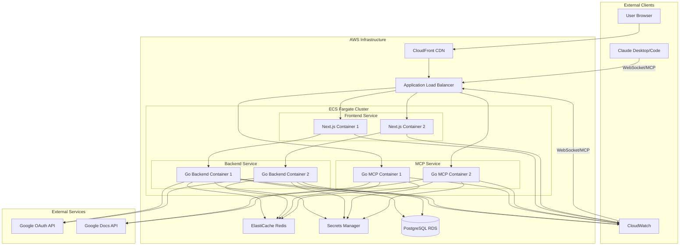

# MCP Google Docs Editor Architecture Document - Epic 1: Foundation & Infrastructure

## Introduction

This document outlines the full-stack architecture specifically for Epic 1: Foundation & Infrastructure of the MCP Google Docs Editor. It establishes a modern web application with **Next.js frontend** and **Go backend services**, implementing AWS containerized infrastructure, monitoring, CI/CD pipeline, and core architectural patterns that will support all future epics.

**Architecture Overview:**
- **Frontend:** Next.js 14 with App Router, React Server Components, and Tailwind CSS
- **Backend:** Go microservices handling MCP protocol, OAuth, and Google Docs operations
- **Communication:** REST API and WebSocket for real-time MCP protocol
- **Infrastructure:** AWS ECS Fargate for containerized services, not Lambda
- **Deployment:** Terraform Infrastructure as Code with GitHub Actions CI/CD

### Starter Template or Existing Project

No starter template will be used. We'll use **create-next-app** for the Next.js frontend with TypeScript and Tailwind CSS configuration, and build the Go backend from scratch using standard libraries and carefully selected packages for MCP protocol compliance.

### Change Log

| Date | Version | Description | Author |
|------|---------|-------------|--------|
| 2025-01-07 | 1.0.0 | Initial architecture document | Winston (AI Architect) |

## High Level Architecture

### Technical Summary

The MCP Google Docs Editor implements a modern full-stack architecture with Next.js 14 for the frontend and Go microservices for the backend. The frontend provides a responsive user interface for authentication, document management, and operation monitoring, while the Go backend handles MCP protocol communication, OAuth flows, and Google Docs API interactions. The system uses AWS Lambda for serverless Go services with API Gateway for REST endpoints and WebSocket support for real-time MCP communication. This architecture supports the PRD's goal of 99% operation success rate with comprehensive error handling and monitoring.

### High Level Overview

1. **Architectural Style:** 3-Service Microservices Architecture with containerized deployment
2. **Repository Structure:** Monorepo structure containing frontend, backend, and MCP service code
3. **Service Architecture:**
   - **Frontend Service:** Next.js containers for user interface, authentication flows, and document management UI
   - **Backend Service:** Go API containers for user management, OAuth token management, session persistence, and user data operations
   - **MCP Service:** Dedicated Go containers implementing MCP protocol for Claude Code and ChatGPT web interface communication, handling Google Docs API integration
4. **Primary Data Flow:** User → ALB → Frontend Service → Backend Service (auth/user data) | Claude/ChatGPT → ALB → MCP Service → Google Docs API
5. **Key Architectural Decisions:**
   - **3-Service Separation:** Clean boundaries between UI, user management, and MCP protocol concerns
   - **Next.js 14 with App Router** for modern React features and optimal performance in Frontend Service
   - **Go with Fiber framework** for high-performance Backend Service API operations
   - **Go with Mark3Labs MCP-Go** for streamlined MCP Service protocol implementation
   - **ECS Fargate** for serverless container management across all 3 services
   - **MCP Protocol Implementation** using Mark3Labs MCP Go library for standardized Claude/ChatGPT integration
   - **Redis caching (ElastiCache)** shared between Backend and MCP services for OAuth tokens
   - **Application Load Balancer** routing HTTP to Frontend/Backend and WebSocket to MCP Service
   - **Infrastructure as Code** using Terraform for reproducible AWS deployments

### High Level Project Diagram



### Architectural and Design Patterns

- **Command Pattern:** Each document operation (replace, append, insert) implemented as discrete command with validation and execution logic - *Rationale:* Enables clean separation of concerns and easy addition of new operations
- **Repository Pattern:** Abstract token storage and management behind interfaces - *Rationale:* Allows switching between Redis and other storage solutions without affecting business logic
- **Circuit Breaker Pattern:** Protect against Google API failures with fallback mechanisms - *Rationale:* Ensures system resilience during external service disruptions
- **Dependency Injection:** Wire dependencies through interfaces for all major components - *Rationale:* Enables comprehensive testing and loose coupling between components
- **Middleware Chain Pattern:** Process requests through authentication, logging, error handling layers - *Rationale:* Provides consistent cross-cutting concerns handling
- **Builder Pattern:** Construct complex Google Docs API requests incrementally - *Rationale:* Manages complexity of document formatting operations

## Tech Stack

Let me present the technology choices for your approval. These are critical decisions that will guide the entire implementation:

### Cloud Infrastructure
- **Provider:** AWS (Amazon Web Services)
- **Container Platform:** ECS Fargate (serverless containers)
- **Key Services:**
  - Compute: ECS Fargate clusters for frontend and backend services
  - Networking: Application Load Balancer, VPC, CloudFront CDN
  - Storage: ElastiCache (Redis), RDS (if needed), S3 for static assets
  - Monitoring: CloudWatch, AWS X-Ray for distributed tracing
  - Security: Secrets Manager, IAM roles, Security Groups
- **Deployment Regions:**
  - Primary: us-east-1
  - Future DR: us-west-2

### Technology Stack Table

#### Frontend Technologies

| Category | Technology | Version | Purpose | Rationale |
|----------|------------|---------|---------|-----------|
| **Framework** | Next.js | 14.1.0 | React framework with SSR/SSG | App Router, React Server Components, excellent DX |
| **Language** | TypeScript | 5.3.3 | Type-safe JavaScript | Better IDE support, fewer runtime errors |
| **UI Library** | React | 18.2.0 | Component-based UI | Industry standard, huge ecosystem |
| **Styling** | Tailwind CSS | 3.4.0 | Utility-first CSS | Rapid development, consistent design |
| **UI Components** | shadcn/ui | Latest | Pre-built components | Accessible, customizable, well-designed |
| **State Management** | Zustand | 4.4.7 | Client state management | Simple, TypeScript-friendly, lightweight |
| **Forms** | React Hook Form | 7.48.0 | Form handling | Performance, validation, TypeScript support |
| **Validation** | Zod | 3.22.4 | Schema validation | TypeScript integration, runtime validation |
| **HTTP Client** | Axios | 1.6.2 | API communication | Interceptors, request/response transformation |
| **WebSocket** | socket.io-client | 4.6.0 | Real-time communication | Reliable, auto-reconnection, event-based |
| **Auth** | NextAuth.js | 4.24.5 | Authentication | OAuth support, session management |
| **Testing** | Jest | 29.7.0 | Unit testing | Fast, snapshot testing, good coverage |
| **E2E Testing** | Playwright | 1.40.0 | End-to-end testing | Cross-browser, reliable, fast |
| **Linting** | ESLint | 8.55.0 | Code quality | Catch errors, enforce standards |
| **Formatting** | Prettier | 3.1.1 | Code formatting | Consistent style, auto-format |

#### Backend Technologies

| Category | Technology | Version | Purpose | Rationale |
|----------|------------|---------|---------|-----------|
| **Language** | Go | 1.21.5 | Backend development language | High performance, efficient containerized execution, excellent concurrency |
| **Containerization** | Docker | 24.0.0 | Container platform | Consistent deployment, scalability |
| **Base Image** | golang:1.21-alpine | Latest | Minimal container image | Small size, security, fast builds |
| **Backend Framework** | Fiber | 2.52.0 | HTTP framework for Backend Service | High performance, Express-like API, excellent middleware |
| **MCP Protocol Library** | Mark3Labs MCP-Go | Latest | Streamlined Model Context Protocol implementation | Type-safe, stdio transport, LLM-optimized design |

#### Infrastructure Technologies

| Category | Technology | Version | Purpose | Rationale |
|----------|------------|---------|---------|-----------|
| **Container Orchestration** | AWS ECS Fargate | Latest | Serverless containers | No EC2 management, auto-scaling, cost-effective |
| **Load Balancer** | Application Load Balancer | Latest | Traffic distribution | Layer 7 routing, health checks, SSL termination |
| **Container Registry** | Amazon ECR | Latest | Docker image storage | Integrated with ECS, secure, automated scanning |
| **CDN** | CloudFront | Latest | Global content delivery | Fast static asset delivery, edge caching |
| **Networking** | VPC | Latest | Virtual private cloud | Network isolation, security groups, subnets |
| **Database** | PostgreSQL | 15 | Primary database | ACID compliance, JSON support, proven reliability |
| **Database (AWS)** | RDS PostgreSQL | 15 | Managed database | Automated backups, scaling, maintenance |
| **Cache** | Redis | 7 | High-performance cache | Session storage, OAuth tokens, operation status |
| **Cache (AWS)** | ElastiCache Redis | 7 | Managed cache | High availability, automatic failover |
| **OAuth Library** | golang.org/x/oauth2 | 0.15.0 | OAuth 2.0 client | Official Google OAuth library, well-maintained |
| **Google Docs Client** | google.golang.org/api/docs/v1 | 0.150.0 | Google Docs API interaction | Official Google API client |
| **Markdown Parser** | goldmark | 1.6.0 | Markdown to AST conversion | Extensible, CommonMark compliant |
| **Cache** | go-redis/redis | 9.3.0 | Redis client for token caching | Most popular Redis client for Go |
| **Logger** | zerolog | 1.31.0 | Structured JSON logging | Fast, zero-allocation logging |
| **Config Management** | viper | 1.17.0 | Configuration management | Environment variables and file support |
| **Testing** | testify | 1.8.4 | Test assertions and mocks | Comprehensive testing utilities |
| **API Mocking** | gomock | 1.6.0 | Interface mocking | Official Go mocking framework |
| **Linter** | golangci-lint | 1.55.0 | Code quality enforcement | Comprehensive Go linting |

**Important:** These technology choices are definitive for the project. The stack provides:
- **Next.js 14** with App Router for modern React development
- **TypeScript** for type safety across the frontend
- **Go 1.21.5** for high-performance backend services
- **AWS Lambda** for serverless backend execution
- **Vercel** for optimized Next.js hosting
- **Redis** for session and token caching

This combination ensures excellent performance, developer experience, and scalability.

Please confirm or suggest modifications before we proceed.

## Data Models

### User
**Purpose:** Core user management for MCP Google Docs Editor users

**Key Attributes:**
- id: UUID (Primary Key) - Unique identifier for the user
- email: string (Unique) - User's primary email address
- display_name: string - User's display name
- status: enum (active, inactive, suspended) - Account status
- created_at, updated_at, last_active_at: timestamps

**Relationships:**
- Has many GoogleAccounts (1:N) - Multiple Google account connections
- Has many DocumentOperations (1:N) - All operations performed by user

### GoogleAccount
**Purpose:** OAuth credentials and Google account connections per user

**Key Attributes:**
- id: UUID (Primary Key) - Unique identifier
- user_id: UUID (Foreign Key) - Reference to User
- google_email: string - Google account email
- google_user_id: string - Google's unique user identifier
- access_token_encrypted: text - Encrypted OAuth access token
- refresh_token_encrypted: text - Encrypted OAuth refresh token
- token_expires_at: timestamp - Token expiration time
- scopes: text[] - OAuth scopes granted
- is_primary: boolean - Primary account flag for the user

**Relationships:**
- Belongs to User (N:1)
- Has many DocumentOperations (1:N)

### DocumentOperation
**Purpose:** Complete audit trail of all document operations for debugging and metrics

**Key Attributes:**
- id: UUID (Primary Key) - Unique operation identifier
- user_id, google_account_id: UUIDs - User and account references
- document_id: string - Google Docs document ID
- operation_type: enum - (replace_all, append, prepend, replace_match, insert_before, insert_after)
- content_preview: text - First 500 chars of content (debugging only)
- anchor_text: text - Anchor text for positioned operations
- status: enum - (pending, processing, completed, failed)
- matches_found, matches_changed: integers - Operation results
- error_code, error_message: strings - Error details
- error_hints: JSONB - Structured recovery suggestions
- execution_time_ms: integer - Performance tracking
- document_size_chars: integer - Document size at operation time

**Relationships:**
- Belongs to User (N:1)
- Belongs to GoogleAccount (N:1)

### DocumentMetadata
**Purpose:** Cache document information to reduce Google API calls

**Key Attributes:**
- document_id: string (Primary Key) - Google Docs document ID
- title: text - Document title
- owner_email: string - Document owner
- last_modified_time: timestamp - Last modification time
- size_estimate: integer - Estimated character count
- permissions: JSONB - Cached permission information
- expires_at: timestamp - Cache TTL (1 hour default)

**Relationships:**
- Referenced by DocumentOperations for context

### SystemMetrics
**Purpose:** Aggregated metrics for monitoring, alerting, and analytics

**Key Attributes:**
- id: UUID (Primary Key) - Unique identifier
- metric_name: string - Metric identifier (e.g., 'operation_success_rate')
- metric_value: decimal - The measured value
- dimensions: JSONB - Additional context (e.g., operation_type, user_segment)
- aggregation_period: enum - (minute, hour, day)
- period_start, period_end: timestamps - Time window for aggregation

**Relationships:**
- Standalone entity for system monitoring and business intelligence

## Components

### Frontend Components (Next.js)

#### Homepage Dashboard
**Responsibility:** Display service status, user authentication state, and recent operations

**Key Interfaces:**
- Server Component for initial data fetch
- Client Components for real-time updates
- WebSocket connection status indicator

**Dependencies:** API Routes, WebSocket client

**Technology Stack:** Next.js App Router, React Server Components, Tailwind CSS

#### Authentication Module
**Responsibility:** Handle user authentication flow and session management

**Key Interfaces:**
- Login/Logout components
- OAuth redirect handling
- Session context provider
- Protected route wrapper

**Dependencies:** NextAuth.js, Backend OAuth endpoints

**Technology Stack:** NextAuth.js, React Context API

#### Document Operations UI
**Responsibility:** Interface for executing document operations

**Key Interfaces:**
- Operation selector (replace, append, prepend, etc.)
- Markdown editor with preview
- Document selector/search
- Operation status display

**Dependencies:** Backend API, Form validation

**Technology Stack:** React Hook Form, Zod validation, Monaco Editor

#### Real-time Status Monitor
**Responsibility:** Display real-time operation status and system metrics

**Key Interfaces:**
- WebSocket event listeners
- Operation progress indicators
- Error display with recovery hints
- Success notifications

**Dependencies:** WebSocket connection, Toast notifications

**Technology Stack:** socket.io-client, React Query for caching

### Backend Components (Go)

#### MCP Protocol Handler
**Responsibility:** Handle MCP protocol communication with Claude AI

**Key Interfaces:**
- WebSocket endpoint for bidirectional communication
- Tool registration and discovery
- Request/response message handling

**Dependencies:** Network layer, Command Processor

**Technology Stack:** Go stdlib net/http, gorilla/websocket for WebSocket support

#### OAuth Manager
**Responsibility:** Manage OAuth authentication flow and token lifecycle

**Key Interfaces:**
- InitiateOAuth() - Start OAuth flow
- ExchangeCode(code string) - Exchange auth code for tokens
- RefreshToken(userID string) - Refresh expired tokens
- GetValidToken(userID string) - Retrieve valid access token

**Dependencies:** Redis Cache, Google OAuth Service

**Technology Stack:** golang.org/x/oauth2, go-redis client

#### REST API Gateway
**Responsibility:** Expose REST endpoints for frontend consumption

**Key Interfaces:**
- POST /api/operations - Execute document operation
- GET /api/documents - List user documents
- GET /api/operations/:id - Get operation status
- GET /api/health - Health check endpoint

**Dependencies:** Command Processor, OAuth Manager

**Technology Stack:** Gin framework, JWT validation

### Command Processor
**Responsibility:** Parse and execute document editing commands

**Key Interfaces:**
- ProcessCommand(cmd DocumentOperation) - Execute document operation
- ValidateCommand(cmd DocumentOperation) - Validate operation parameters
- GetCommandStatus(operationID string) - Check operation status

**Dependencies:** OAuth Manager, Document Service, Markdown Converter

**Technology Stack:** Command pattern implementation in pure Go

### Document Service
**Responsibility:** Interact with Google Docs API for document manipulation

**Key Interfaces:**
- GetDocument(docID string) - Retrieve document content
- UpdateDocument(docID string, requests []Request) - Apply batch updates
- ValidateAccess(docID string, token string) - Check document permissions

**Dependencies:** Google Docs API Client, Circuit Breaker

**Technology Stack:** google.golang.org/api/docs/v1

### Markdown Converter
**Responsibility:** Convert Markdown to Google Docs API requests

**Key Interfaces:**
- ParseMarkdown(content string) - Parse Markdown to AST
- ConvertToRequests(ast Node) - Generate Docs API requests
- HandleImages(urls []string) - Process image insertions
- FormatTables(tables []Table) - Convert Markdown tables

**Dependencies:** Markdown Parser Library

**Technology Stack:** goldmark parser with custom renderers

### Cache Manager
**Responsibility:** Manage Redis cache for tokens and temporary data

**Key Interfaces:**
- StoreToken(userID string, token AuthToken) - Cache auth token
- GetToken(userID string) - Retrieve cached token
- InvalidateToken(userID string) - Remove expired token
- SetTTL(key string, duration time.Duration) - Set expiration

**Dependencies:** Redis Instance

**Technology Stack:** go-redis/redis v9 client

### Component Diagram


## External APIs

### Google OAuth 2.0 API
- **Purpose:** Authenticate users and obtain access tokens for Google Docs API
- **Documentation:** https://developers.google.com/identity/protocols/oauth2
- **Base URL(s):** https://accounts.google.com/o/oauth2/v2/auth, https://oauth2.googleapis.com/token
- **Authentication:** Client ID and Client Secret
- **Rate Limits:** No strict limits for OAuth flow

**Key Endpoints Used:**
- `GET /auth` - Initiate OAuth consent flow
- `POST /token` - Exchange authorization code for tokens
- `POST /token` (refresh) - Refresh expired access tokens

**Integration Notes:** Implement PKCE for enhanced security, store refresh tokens securely

### Google Docs API v1
- **Purpose:** Read and modify Google Docs documents
- **Documentation:** https://developers.google.com/docs/api/reference/rest
- **Base URL(s):** https://docs.googleapis.com/v1
- **Authentication:** OAuth 2.0 Bearer token
- **Rate Limits:** 60 requests per minute per user

**Key Endpoints Used:**
- `GET /documents/{documentId}` - Retrieve document structure
- `POST /documents/{documentId}:batchUpdate` - Apply multiple edits

**Integration Notes:** Batch operations for efficiency, implement exponential backoff for rate limiting

## Core Workflows


## REST API Spec

While this is primarily an MCP server, it exposes some REST endpoints for OAuth callback and health checks:

```yaml
openapi: 3.0.0
info:
  title: MCP Google Docs Editor API
  version: 1.0.0
  description: REST endpoints for OAuth and health monitoring
servers:
  - url: https://mcp-gdocs-editor.example.com
    description: Production server

paths:
  /health:
    get:
      summary: Health check endpoint
      responses:
        '200':
          description: Service is healthy
          content:
            application/json:
              schema:
                type: object
                properties:
                  status:
                    type: string
                    example: "healthy"
                  timestamp:
                    type: string
                    format: date-time

  /oauth/callback:
    get:
      summary: OAuth callback endpoint
      parameters:
        - name: code
          in: query
          required: true
          schema:
            type: string
        - name: state
          in: query
          required: true
          schema:
            type: string
      responses:
        '302':
          description: Redirect after successful authentication
        '400':
          description: Invalid authorization code

  /mcp:
    get:
      summary: MCP WebSocket endpoint
      description: Upgrades to WebSocket for MCP protocol communication
      responses:
        '101':
          description: Switching to WebSocket protocol
```

## Database Design

### Database Selection

**Primary Database: PostgreSQL 15**
- **Rationale:** ACID compliance for user data integrity, excellent JSON support for flexible schemas, proven reliability for 30+ concurrent users, supports both relational and document-like queries

**Caching Layer: Redis 7 (AWS ElastiCache)**
- **Rationale:** High-performance caching for OAuth tokens, session data, and operation status

**Current Deployment:**
- **Local Development:** PostgreSQL + Redis containers in docker-compose.yml
- **AWS Production:** RDS PostgreSQL + ElastiCache Redis for managed services with high availability
- **Container Support**: All services containerized for consistent environments across dev/staging/prod

### Database Schema

```sql
-- Users table: Core user management
CREATE TABLE users (
    id UUID PRIMARY KEY DEFAULT gen_random_uuid(),
    email VARCHAR(255) NOT NULL UNIQUE,
    display_name VARCHAR(100),
    created_at TIMESTAMP WITH TIME ZONE DEFAULT NOW(),
    updated_at TIMESTAMP WITH TIME ZONE DEFAULT NOW(),
    last_active_at TIMESTAMP WITH TIME ZONE DEFAULT NOW(),
    status VARCHAR(20) DEFAULT 'active' CHECK (status IN ('active', 'inactive', 'suspended'))
);

-- Google accounts: OAuth credentials per user
CREATE TABLE google_accounts (
    id UUID PRIMARY KEY DEFAULT gen_random_uuid(),
    user_id UUID NOT NULL REFERENCES users(id) ON DELETE CASCADE,
    google_email VARCHAR(255) NOT NULL,
    google_user_id VARCHAR(100) NOT NULL,
    access_token_encrypted TEXT NOT NULL,
    refresh_token_encrypted TEXT NOT NULL,
    token_expires_at TIMESTAMP WITH TIME ZONE NOT NULL,
    scopes TEXT[] NOT NULL DEFAULT ARRAY['https://www.googleapis.com/auth/documents'],
    is_primary BOOLEAN DEFAULT FALSE,
    created_at TIMESTAMP WITH TIME ZONE DEFAULT NOW(),
    updated_at TIMESTAMP WITH TIME ZONE DEFAULT NOW(),
    UNIQUE(user_id, google_email),
    UNIQUE(google_user_id)
);

-- Document operations: Track all operations for debugging and metrics
CREATE TABLE document_operations (
    id UUID PRIMARY KEY DEFAULT gen_random_uuid(),
    user_id UUID NOT NULL REFERENCES users(id) ON DELETE CASCADE,
    google_account_id UUID NOT NULL REFERENCES google_accounts(id) ON DELETE CASCADE,
    document_id VARCHAR(100) NOT NULL, -- Google Docs document ID
    operation_type VARCHAR(20) NOT NULL CHECK (operation_type IN
        ('replace_all', 'append', 'prepend', 'replace_match', 'insert_before', 'insert_after')),

    -- Operation parameters
    content_preview TEXT, -- First 500 chars of content (for debugging)
    anchor_text TEXT, -- For positioned operations
    case_sensitive BOOLEAN DEFAULT TRUE,

    -- Results
    status VARCHAR(20) DEFAULT 'pending' CHECK (status IN ('pending', 'processing', 'completed', 'failed')),
    matches_found INTEGER DEFAULT 0,
    matches_changed INTEGER DEFAULT 0,
    error_code VARCHAR(50),
    error_message TEXT,
    error_hints JSONB,

    -- Timing and metadata
    started_at TIMESTAMP WITH TIME ZONE DEFAULT NOW(),
    completed_at TIMESTAMP WITH TIME ZONE,
    execution_time_ms INTEGER,
    document_size_chars INTEGER,

    -- Audit trail
    created_at TIMESTAMP WITH TIME ZONE DEFAULT NOW(),
    updated_at TIMESTAMP WITH TIME ZONE DEFAULT NOW()
);

-- Document metadata: Cache document info to avoid repeated API calls
CREATE TABLE document_metadata (
    document_id VARCHAR(100) PRIMARY KEY,
    title TEXT NOT NULL,
    owner_email VARCHAR(255),
    last_modified_time TIMESTAMP WITH TIME ZONE,
    size_estimate INTEGER, -- Estimated character count
    permissions JSONB, -- Cached permission info
    created_at TIMESTAMP WITH TIME ZONE DEFAULT NOW(),
    updated_at TIMESTAMP WITH TIME ZONE DEFAULT NOW(),
    expires_at TIMESTAMP WITH TIME ZONE DEFAULT (NOW() + INTERVAL '1 hour') -- Cache TTL
);

-- System metrics: Aggregated metrics for monitoring
CREATE TABLE system_metrics (
    id UUID PRIMARY KEY DEFAULT gen_random_uuid(),
    metric_name VARCHAR(50) NOT NULL,
    metric_value DECIMAL(10,4) NOT NULL,
    dimensions JSONB, -- e.g., {"operation_type": "replace_all", "status": "success"}
    aggregation_period VARCHAR(20) NOT NULL, -- 'minute', 'hour', 'day'
    period_start TIMESTAMP WITH TIME ZONE NOT NULL,
    period_end TIMESTAMP WITH TIME ZONE NOT NULL,
    created_at TIMESTAMP WITH TIME ZONE DEFAULT NOW(),
    UNIQUE(metric_name, dimensions, aggregation_period, period_start)
);

-- Indexes for performance
CREATE INDEX idx_users_email ON users(email);
CREATE INDEX idx_users_last_active ON users(last_active_at DESC);

CREATE INDEX idx_google_accounts_user_id ON google_accounts(user_id);
CREATE INDEX idx_google_accounts_primary ON google_accounts(user_id, is_primary) WHERE is_primary = TRUE;
CREATE INDEX idx_google_accounts_expires ON google_accounts(token_expires_at);

CREATE INDEX idx_operations_user_id ON document_operations(user_id);
CREATE INDEX idx_operations_document_id ON document_operations(document_id);
CREATE INDEX idx_operations_status ON document_operations(status);
CREATE INDEX idx_operations_created_at ON document_operations(created_at DESC);
CREATE INDEX idx_operations_type_status ON document_operations(operation_type, status);

CREATE INDEX idx_document_metadata_expires ON document_metadata(expires_at);

CREATE INDEX idx_metrics_name_period ON system_metrics(metric_name, aggregation_period, period_start DESC);
```

### Redis Cache Structure

```go
// Redis Key Patterns for High-Performance Caching

// User sessions - Hash
// Key: session:{sessionID}
// Fields: user_id, google_account_id, expires_at, created_at
// TTL: 24 hours

// OAuth tokens (hot cache) - Hash
// Key: token:{google_account_id}
// Fields: access_token, expires_at, last_refreshed
// TTL: Set to token expiry time

// Operation status (real-time) - String with JSON
// Key: op:{operationID}
// Value: JSON with current status, progress, errors
// TTL: 1 hour

// Rate limiting - Counter
// Key: rate:{userID}:{window}
// Value: request count
// TTL: 60 seconds (sliding window)

// Circuit breaker state - String
// Key: circuit:{service}
// Value: "open" | "closed" | "half-open"
// TTL: Based on circuit breaker policy

// Document cache - Hash
// Key: doc:{documentID}
// Fields: title, permissions, size, last_check
// TTL: 30 minutes
```

## Source Tree

```plaintext
mcp-google-docs-editor/
├── services/
│   ├── frontend/                   # Frontend Service - Next.js Application
│   │   ├── app/                    # App Router directory
│   │   │   ├── (auth)/             # Auth group routes
│   │   │   │   ├── login/
│   │   │   │   │   └── page.tsx    # Login page
│   │   │   │   └── callback/
│   │   │   │       └── page.tsx    # OAuth callback
│   │   │   ├── (dashboard)/        # Protected routes
│   │   │   │   ├── dashboard/
│   │   │   │   │   └── page.tsx    # Main dashboard
│   │   │   │   ├── documents/
│   │   │   │   │   └── page.tsx    # Document list
│   │   │   │   └── operations/
│   │   │   │       └── page.tsx    # Operations UI
│   │   │   ├── api/                # API Routes (proxies to backend)
│   │   │   │   └── proxy/
│   │   │   │       └── route.ts    # Backend API proxy
│   │   │   ├── layout.tsx          # Root layout
│   │   │   ├── page.tsx            # Homepage
│   │   │   └── globals.css         # Global styles
│   │   ├── components/             # React Components
│   │   │   ├── ui/                 # shadcn/ui components
│   │   │   ├── auth/               # Auth components
│   │   │   ├── dashboard/          # Dashboard components
│   │   │   └── operations/         # Operation components
│   │   ├── lib/                    # Utility functions
│   │   │   ├── api/                # API client for backend service
│   │   │   ├── hooks/              # Custom React hooks
│   │   │   └── utils/              # Helper functions
│   │   ├── public/                 # Static assets
│   │   ├── package.json            # Frontend dependencies
│   │   ├── tsconfig.json           # TypeScript config
│   │   ├── next.config.js          # Next.js config
│   │   ├── tailwind.config.ts      # Tailwind config
│   │   ├── Dockerfile              # Frontend container definition
│   │   └── .env.local              # Frontend env vars
│   │
│   ├── backend/                    # Backend Service - User Management API
│   │   ├── cmd/
│   │   │   └── main.go             # Backend API server entry point
│   │   ├── internal/
│   │   │   ├── api/
│   │   │   │   ├── handlers/       # HTTP handlers
│   │   │   │   │   ├── auth.go     # Authentication handlers
│   │   │   │   │   ├── users.go    # User management handlers
│   │   │   │   │   └── health.go   # Health check handlers
│   │   │   │   ├── middleware/     # HTTP middleware
│   │   │   │   │   ├── cors.go     # CORS middleware
│   │   │   │   │   ├── auth.go     # Auth middleware
│   │   │   │   │   └── logging.go  # Logging middleware
│   │   │   │   └── routes.go       # API route definitions
│   │   │   ├── auth/
│   │   │   │   ├── oauth.go        # OAuth manager
│   │   │   │   ├── tokens.go       # Token management
│   │   │   │   └── jwt.go          # JWT handling
│   │   │   ├── users/
│   │   │   │   ├── service.go      # User service
│   │   │   │   ├── repository.go   # User data access
│   │   │   │   └── models.go       # User models
│   │   │   ├── cache/
│   │   │   │   └── redis.go        # Redis client
│   │   │   └── config/
│   │   │       └── config.go       # Configuration
│   │   ├── pkg/
│   │   │   ├── errors/             # Custom errors
│   │   │   │   └── errors.go       # Error definitions
│   │   │   └── utils/              # Utility functions
│   │   ├── go.mod                  # Go module definition
│   │   ├── go.sum                  # Go dependencies
│   │   ├── Dockerfile              # Backend container definition
│   │   └── .env                    # Backend env vars
│   │
│   └── mcp-service/                # MCP Service - Mark3Labs Implementation
│       ├── cmd/
│       │   └── main.go             # MCP server entry point with Mark3Labs library
│       ├── internal/
│       │   ├── server/
│       │   │   ├── mcp.go          # Mark3Labs MCP server setup and configuration
│       │   │   ├── tools.go        # Tool registration with schema validation
│       │   │   ├── handlers.go     # Strongly-typed tool handlers
│       │   │   └── middleware.go   # Recovery and capability middleware
│       │   ├── operations/
│       │   │   ├── processor.go    # Operation processor with parameter validation
│       │   │   ├── replace.go      # Replace operations with MCP result types
│       │   │   ├── append.go       # Append operations with MCP result types
│       │   │   ├── insert.go       # Insert operations with MCP result types
│       │   │   └── validator.go    # Parameter validation with enum/pattern support
│       │   ├── docs/
│       │   │   ├── service.go      # Document service
│       │   │   ├── client.go       # Google Docs client
│       │   │   ├── converter.go    # Markdown converter
│       │   │   └── formatter.go    # Google Docs formatter
│       │   ├── auth/
│       │   │   ├── oauth.go        # Google OAuth for service accounts
│       │   │   └── tokens.go       # Token validation with backend
│       │   ├── cache/
│       │   │   └── redis.go        # Redis client (shared with backend)
│       │   └── config/
│       │       └── config.go       # Configuration
│       ├── pkg/
│       │   ├── types/              # MCP request/response type definitions
│       │   │   ├── tools.go        # Tool parameter structures
│       │   │   └── results.go      # MCP result type wrappers
│       │   ├── errors/             # Custom errors
│       │   │   └── errors.go       # Error definitions
│       │   └── utils/              # Utility functions
│       ├── go.mod                  # Go module with Mark3Labs MCP-Go dependency
│       ├── go.sum                  # Go dependencies
│       ├── Dockerfile              # MCP service container definition
│       └── .env                    # MCP service env vars
│
├── infrastructure/                 # Infrastructure as Code
│   ├── terraform/
│   │   ├── modules/
│   │   │   ├── ecs/                # ECS Fargate module
│   │   │   ├── alb/                # Application Load Balancer module
│   │   │   ├── ecr/                # Container Registry module
│   │   │   ├── vpc/                # Virtual Private Cloud module
│   │   │   └── redis/              # ElastiCache Redis module
│   │   ├── environments/
│   │   │   ├── dev/                # Dev environment
│   │   │   ├── staging/            # Staging environment
│   │   │   └── prod/               # Production environment
│   │   └── main.tf                 # Main Terraform config
│   └── docker-compose.yml          # Local development environment
│
├── .github/
│   └── workflows/
│       ├── build-images.yml        # Docker image builds
│       ├── deploy-ecs.yml          # ECS deployment
│       └── pr-preview.yml          # PR preview environment
│
├── scripts/                        # Build and deploy scripts
│   └── (various shell scripts)     # Complex automation logic
│
├── docs/                           # Documentation
│   ├── prd.md                      # Product Requirements
│   └── architecture.md             # This document
│
├── Makefile                        # Primary build and deploy interface
├── docker-compose.yml              # Local development stack
├── package.json                    # Monorepo root package
├── turbo.json                      # Turborepo config
├── .gitignore                      # Git ignore rules
└── README.md                       # Project documentation
```

## Infrastructure and Deployment

### Infrastructure as Code
- **Tool:** Terraform 1.6.0
- **Location:** `infrastructure/terraform/`
- **Approach:** Modular Terraform for ECS Fargate, VPC, ALB, and supporting AWS services

### Deployment Strategy
- **Containers:** Docker images built and pushed to ECR (Elastic Container Registry)
- **Orchestration:** AWS ECS Fargate for serverless container management
- **Load Balancing:** Application Load Balancer with target groups for each service
- **CI/CD Platform:** GitHub Actions
- **Pipeline Configuration:** `.github/workflows/build-images.yml`, `.github/workflows/deploy-ecs.yml`
- **Infrastructure as Code:** Terraform modules for reproducible deployments

### Build and Deploy Automation
- **Primary Interface:** Makefile in project root provides standardized commands (`make dev`, `make build`, `make deploy`)
- **Complex Logic:** Shell scripts in `./scripts/` folder handle sophisticated automation tasks
- **Approach:** Hybrid system where Makefile coordinates high-level operations and delegates complex logic to shell scripts
- **Benefits:** Simple developer interface with powerful scripting capabilities for AWS operations and multi-service coordination

### ECS Service Configuration
- **Frontend Service:** Next.js containers behind ALB target group on port 3000
- **Backend API Service:** Go containers behind ALB target group on port 8080
- **MCP Protocol Service:** Go containers with WebSocket support on port 8081
- **Auto Scaling:** CPU and memory-based scaling policies
- **Health Checks:** Application-level health endpoints

### Environments
- **Development:**
  - Local: Root-level `docker-compose.yml` with all services (frontend, backend, Redis, databases)
  - AWS: Single ECS cluster with dev task definitions
- **Staging:**
  - Dedicated ECS cluster with staging configuration
  - Separate ALB and target groups
- **Production:**
  - Production ECS cluster with high-availability configuration
  - Multi-AZ deployment with auto-scaling

### Local Development Setup

Use Docker Compose for consistent development environments. The project provides a complete containerized development stack.

**Primary Development Commands:**
```bash
# Start all services (recommended for development)
make dev
# or
docker-compose up --build

# Start services in background
make dev-bg
# or
docker-compose up -d --build

# Run tests with Docker
make test-docker
# or
./scripts/test.sh

# Quick development scripts
./scripts/dev.sh           # Start with health checks
./scripts/dev-watch.sh     # Start with file watching
```

**Docker Compose Structure:**
- **Services:** Frontend (Next.js), Backend (Go), supporting databases
- **Networking:** Internal Docker network with service discovery
- **File Watching:** Automatic rebuilds on code changes with `docker-compose up --watch`
- **Health Checks:** Built-in health monitoring for all services
- **Development Tools:** Integrated testing and debugging support

**Benefits:**
- Single `docker-compose up` command to start entire stack (frontend + 2 backend services + PostgreSQL + Redis)
- Consistent environment across all developers
- Service discovery through container networking
- Persistent data volumes for development
- Database migrations run automatically on container start
- Easy debugging with individual service logs
- Hot reloading for development (when configured)

### Environment Promotion Flow
```text
Feature Branch
      ↓ (git push)
Local: docker-compose up + testing
      ↓ (PR merge to main)
ECR Push + Staging ECS Deploy
      ↓ (manual approval)
Production ECS Deploy
```

### Rollback Strategy
- **Method:** ECS service update with previous task definition revision
- **Automation:** Automated rollback on health check failures
- **Trigger Conditions:** Failed health checks, error rate > 5%, response time > 5s
- **Recovery Time Objective:** < 2 minutes for container restart

## Error Handling Strategy

### General Approach
- **Error Model:** Structured errors with codes, messages, and hints
- **Exception Hierarchy:** Base MCPError with specific error types
- **Error Propagation:** Errors bubble up with context preservation

### Logging Standards
- **Library:** zerolog 1.31.0
- **Format:** Structured JSON with context
- **Levels:** debug, info, warn, error, fatal
- **Required Context:**
  - Correlation ID: UUID per request
  - Service Context: component, operation, version
  - User Context: hashed user ID (no PII)

### Error Handling Patterns

#### External API Errors
- **Retry Policy:** Exponential backoff with max 3 retries
- **Circuit Breaker:** Open after 5 consecutive failures, half-open after 30s
- **Timeout Configuration:** 10s for Google API calls
- **Error Translation:** Map Google API errors to user-friendly messages

#### Business Logic Errors
- **Custom Exceptions:** DocumentNotFound, InvalidAnchor, PermissionDenied
- **User-Facing Errors:** Structured JSON with actionable hints
- **Error Codes:** Prefixed by component (AUTH_, DOC_, MCP_)

#### Data Consistency
- **Transaction Strategy:** Atomic operations where possible
- **Compensation Logic:** Rollback partial updates on failure
- **Idempotency:** Operation IDs prevent duplicate processing

## Coding Standards

### Core Standards
- **Languages & Runtimes:** Go 1.21.5
- **Style & Linting:** golangci-lint with project config
- **Test Organization:** Parallel test files (*_test.go) in same package

### Naming Conventions

| Element | Convention | Example |
|---------|------------|---------|
| Packages | lowercase | `auth`, `markdown` |
| Interfaces | PascalCase with suffix | `TokenManager`, `DocService` |
| Functions | PascalCase (exported), camelCase (internal) | `ProcessCommand`, `validateInput` |
| Constants | PascalCase | `MaxRetries`, `DefaultTimeout` |

### Critical Rules
- **No fmt.Println:** Always use structured logger (zerolog)
- **Context propagation:** All functions handling requests must accept context.Context
- **Error wrapping:** Use fmt.Errorf with %w for error chain preservation
- **Interface compliance:** All services must be defined as interfaces first
- **Dependency injection:** No global variables, inject dependencies through constructors

## Test Strategy and Standards

### Testing Philosophy
- **Approach:** Test-driven development where practical
- **Coverage Goals:** Minimum 80% code coverage
- **Test Pyramid:** 60% unit, 30% integration, 10% E2E

### Test Types and Organization

#### Unit Tests
- **Framework:** Go standard testing package
- **File Convention:** `{filename}_test.go` in same directory
- **Location:** Alongside implementation files
- **Mocking Library:** gomock for interfaces
- **Coverage Requirement:** 85% for business logic

**AI Agent Requirements:**
- Generate tests for all public methods
- Cover edge cases and error conditions
- Follow AAA pattern (Arrange, Act, Assert)
- Mock all external dependencies

#### Integration Tests
- **Scope:** Component interactions, external API calls
- **Location:** `tests/integration/`
- **Test Infrastructure:**
  - **Redis:** miniredis for in-memory testing
  - **Google APIs:** Custom mock server with recorded responses
  - **MCP Protocol:** Test harness simulating Claude client

#### End-to-End Tests
- **Framework:** Go standard testing with Docker Compose
- **Scope:** Full workflow from MCP request to document update
- **Environment:** Docker Compose with all services
- **Test Data:** Dedicated test Google account and documents

### Test Data Management
- **Strategy:** Fixtures for unit tests, dedicated test account for E2E
- **Fixtures:** `tests/fixtures/` directory
- **Factories:** Test data builders for complex objects
- **Cleanup:** Automatic cleanup after each test run

### Continuous Testing
- **CI Integration:** Run on every pull request
- **Performance Tests:** Benchmark critical paths
- **Security Tests:** Dependency scanning with Snyk

## Security

### Input Validation
- **Validation Library:** go-playground/validator
- **Validation Location:** Command processor entry point
- **Required Rules:**
  - All external inputs MUST be validated
  - Validation at API boundary before processing
  - Whitelist approach preferred over blacklist

### Authentication & Authorization
- **Auth Method:** OAuth 2.0 with PKCE
- **Session Management:** Stateless with encrypted tokens in Redis
- **Required Patterns:**
  - All endpoints require valid OAuth token
  - Token refresh handled transparently
  - Rate limiting per user

### Secrets Management
- **Development:** .env file (never committed)
- **Production:** GCP Secret Manager
- **Code Requirements:**
  - NEVER hardcode secrets
  - Access via configuration service only
  - No secrets in logs or error messages

### API Security
- **Rate Limiting:** 60 requests/minute per user
- **CORS Policy:** Restricted to Claude domains
- **Security Headers:** X-Content-Type-Options, X-Frame-Options
- **HTTPS Enforcement:** TLS 1.3 minimum

### Data Protection
- **Encryption at Rest:** Redis TLS, encrypted token storage
- **Encryption in Transit:** HTTPS/WSS only
- **PII Handling:** No PII stored, only hashed user IDs
- **Logging Restrictions:** No tokens, no document content

### Dependency Security
- **Scanning Tool:** Snyk in CI pipeline
- **Update Policy:** Monthly security updates
- **Approval Process:** Security review for new dependencies

### Security Testing
- **SAST Tool:** gosec for static analysis
- **DAST Tool:** OWASP ZAP for API testing
- **Penetration Testing:** Quarterly for production

## Next Steps

Since this project has minimal UI components (only OAuth callback page), the primary focus remains on the backend MCP server implementation. The next steps are:

1. **Development Setup:**
   - Initialize Go module and dependencies
   - Set up local development environment with Docker Compose
   - Configure Redis and create Google Cloud project

2. **Implementation Priority:**
   - Start with MCP protocol handler and tool registration
   - Implement OAuth flow and token management
   - Build command processor with basic replace operation
   - Add Markdown to Google Docs converter
   - Implement remaining operations iteratively

3. **DevOps Setup:**
   - Create Terraform configurations for GCP resources
   - Set up GitHub Actions CI/CD pipeline
   - Configure monitoring and alerting

Would you like me to:
1. Run the architecture checklist to validate completeness?
2. Generate more detailed specifications for any component?
3. Create the initial project structure and configuration files?
4. Proceed with any specific aspect of the architecture?
