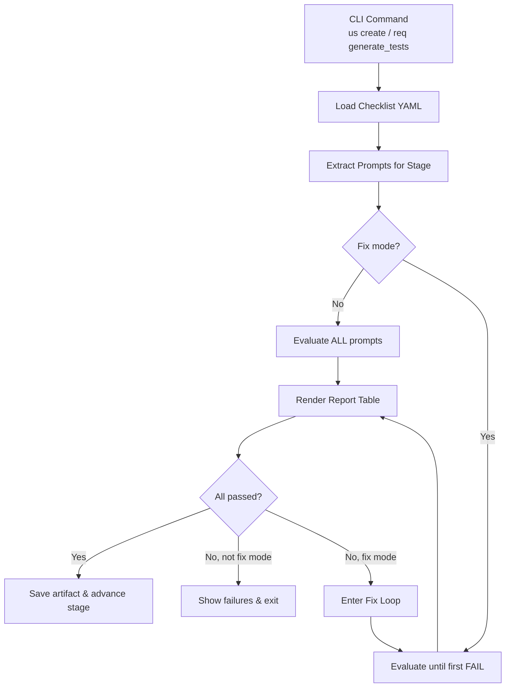
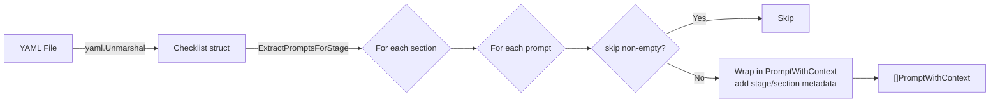
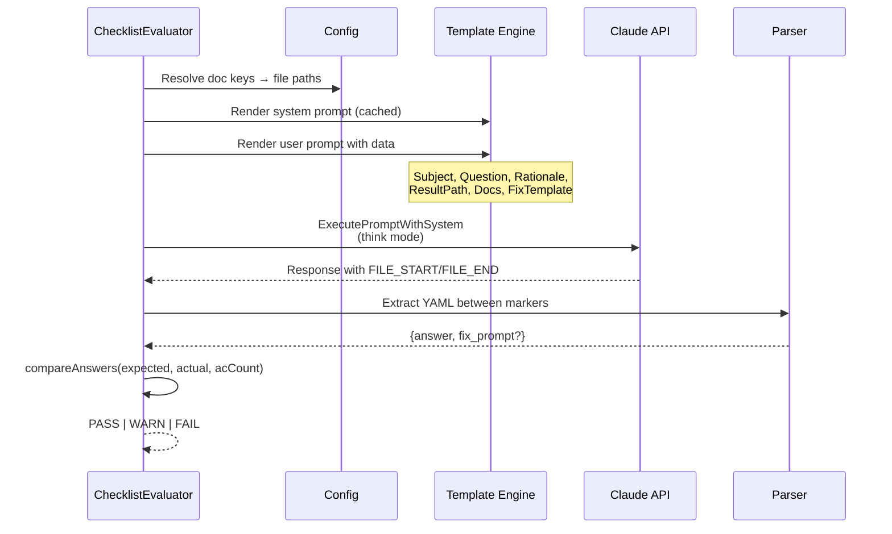
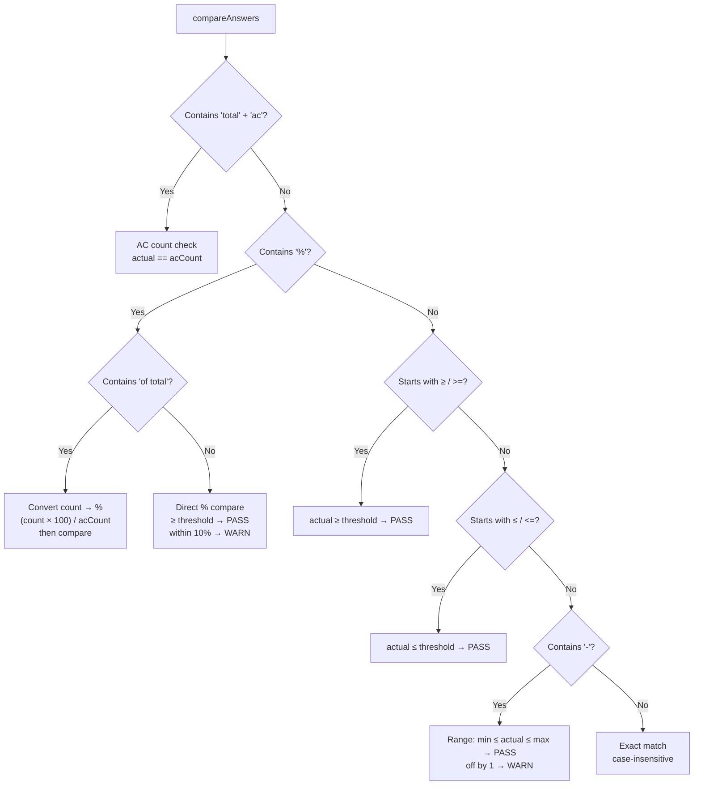
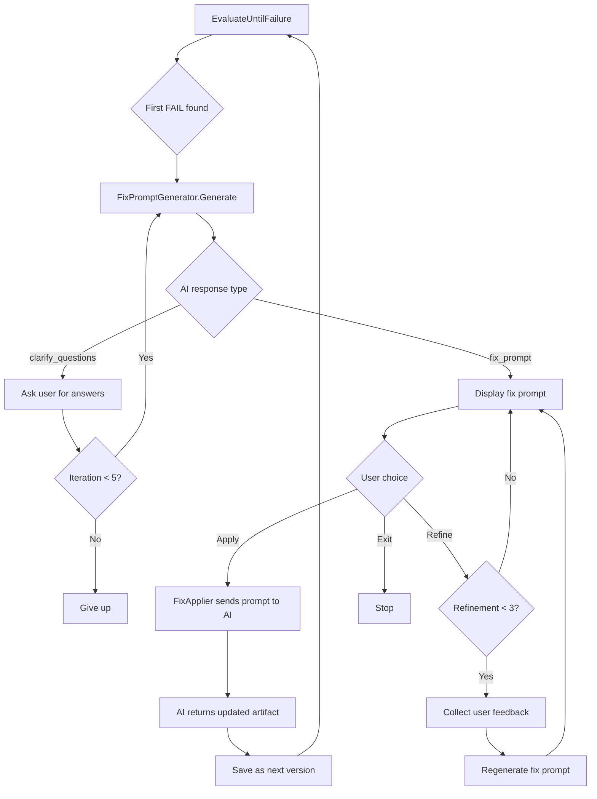

# Checklist Validation Algorithm

This document describes how BMAD CLI validates artifacts (user stories and generated tests) against YAML-based checklists.

## Overview

The checklist validation system is an AI-driven quality gate. A YAML checklist defines questions with expected answers. For each question, the CLI sends the artifact and the question to Claude, parses the AI's answer, and compares it to the expected answer. The result is PASS, WARN, FAIL, or SKIP per question.

There are two checklist files, both validated against the same Yamale schema at build time:

| Checklist file | Purpose | CLI entry point |
|---|---|---|
| `bdd-cli/user-story-description-checklist.yaml` | Validates user stories across 4 stages | `bmad-cli us create/refine/ready` |
| `bdd-cli/test-validation-checklist.yaml` | Validates generated Playwright tests | `bmad-cli req generate_tests` |

## YAML Structure

```yaml
version: "3.0"
default_docs: [architecture, prd]   # optional — doc keys loaded for every prompt
stages:
  - id: story_creation
    name: Story Creation
    sections:
      - id: format
        name: Format
        validation_prompts:
          - Q: "Does the story follow the template?"
            A: "yes"
            rationale: "optional — why this matters"
            skip: ""             # non-empty → skipped
            docs: [prd]          # overrides default_docs for this prompt
            F: "fix template…"   # template for generating fix prompt on failure
```

Key fields on each prompt:

| Field | Role |
|---|---|
| `Q` | Question sent to Claude about the artifact |
| `A` | Expected answer — supports exact match, ranges, comparisons (see below) |
| `rationale` | Included in the AI prompt for context |
| `skip` | If non-empty, the prompt is excluded from evaluation |
| `docs` | Document keys resolved to file paths via config; overrides `default_docs` |
| `F` | Markdown template used by the fix-prompt generator when this check fails |

## Algorithm

### High-Level Flow



### 1. Load and Filter



### 2. Evaluate Each Prompt



All prompts, responses, and parsed results are saved to a temp directory for debugging.

### 3. Answer Comparison Rules



Comparison order matters — AC-count and percentage checks run before generic `≥`/`≤` to avoid misparse.

### 4. Report Generation

After all prompts are evaluated (or after the first FAIL in fix mode), `ChecklistReport.CalculateSummary()` computes:

```
TotalPrompts, PassCount, WarnCount, FailCount, SkipCount, PassRate
```

The report is rendered as a table in the terminal.

### 5. Fix Mode (--fix)



### 6. On All Checks Passed

**User stories:** The story's `stage` field is advanced to the next stage (e.g., `story_creation` → `refinement`), and the story YAML is saved to `docs/stories/`.

**Tests:** The fixed test file is written back to disk at its `TestFilePath`.

## Build-Time Schema Validation

Both checklist YAML files are validated against `bdd-cli/user-story-description-checklist-schema.yaml` using [Yamale](https://github.com/23andMe/Yamale) during `make lint-docs`:

```makefile
yamale -s bdd-cli/user-story-description-checklist-schema.yaml \
         bdd-cli/user-story-description-checklist.yaml \
         bdd-cli/test-validation-checklist.yaml
```

This ensures structural consistency (correct field names, types, required vs optional) before any runtime use.

## Key Source Files

| File | Role |
|---|---|
| `internal/domain/models/checklist/` | Domain models: Checklist, Stage, Section, Prompt, ValidationResult |
| `internal/infrastructure/checklist/checklist_loader.go` | Loads YAML, extracts stage-specific prompts |
| `internal/app/generators/validate/checklist_evaluator.go` | AI evaluation, answer comparison |
| `internal/app/generators/validate/fix_prompt_generator.go` | Fix prompt generation with clarification loop |
| `internal/app/generators/validate/fix_applier.go` | Applies fix prompts to produce updated artifacts |
| `internal/app/commands/us_validation_command.go` | User story validation command |
| `internal/app/commands/req_validation_command.go` | Test validation command |
