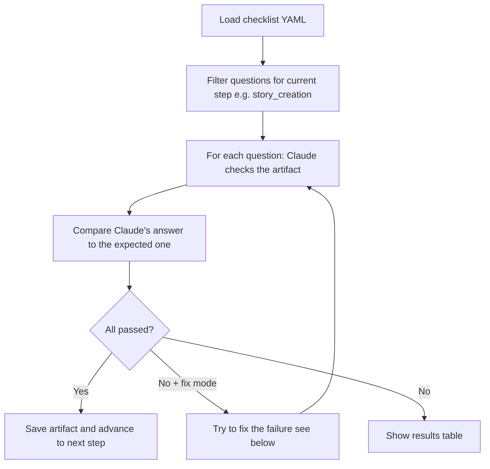
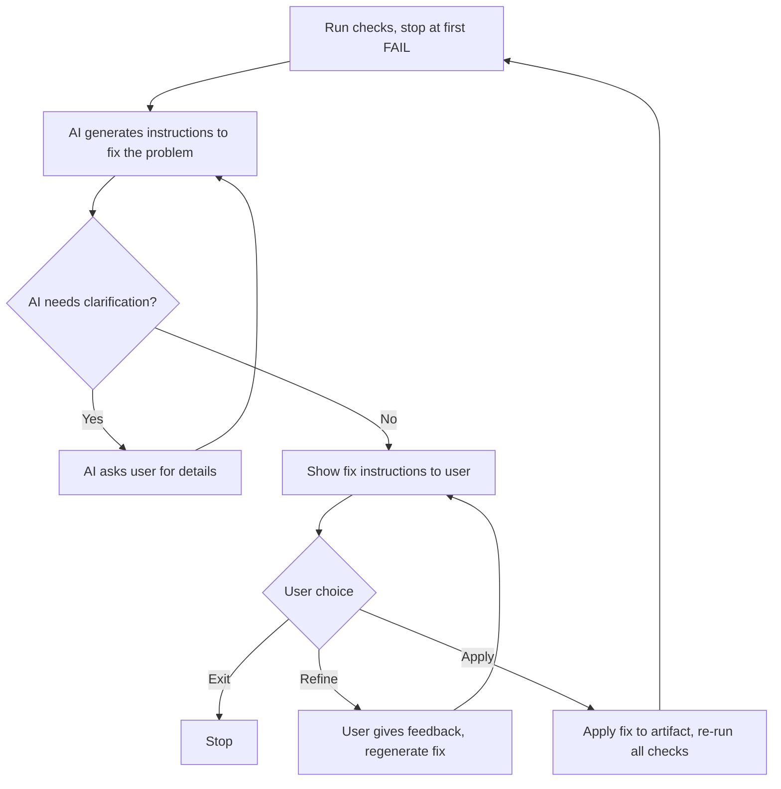

# Checklist Validation

How BMAD CLI checks the quality of user stories and generated tests.

## What It Does

The CLI reads a YAML checklist that contains questions and expected answers. For each question, it asks Claude to check the artifact (a user story or test file). Claude's answer is compared to the expected one. Each check gets a status: PASS, WARN, FAIL, or SKIP.

Two checklists use the same format:

| File | What it checks | Command |
|---|---|---|
| `bdd-cli/user-story-description-checklist.yaml` | User stories (4 stages) | `us create` / `us refine` / `us ready` |
| `bdd-cli/test-validation-checklist.yaml` | Playwright tests | `req generate_tests` |

## Checklist YAML Format

```yaml
version: "3.0"
default_docs: [architecture, prd]
stages:
  - id: story_creation
    name: Story Creation
    sections:
      - id: format
        name: Format
        validation_prompts:
          - Q: "Does the story follow the template?"
            A: "yes"
            rationale: "Why this matters"
            skip: ""        # non-empty = skip this check
            docs: [prd]     # reference docs for this check
            F: "fix template..."
```

| Field | What it does |
|---|---|
| `Q` | Question about the artifact, sent to Claude |
| `A` | Expected answer (see comparison rules below) |
| `rationale` | Extra context for Claude |
| `skip` | If not empty, this check is skipped |
| `docs` | Reference documents to include (overrides `default_docs`) |
| `F` | Template for generating a fix when this check fails |

## How It Works



### Step 1: Load Prompts

1. Read the checklist YAML file
2. Find the right stage (e.g. `story_creation`)
3. Collect all prompts from all sections in that stage
4. Remove prompts where `skip` is set

### Step 2: Check with Claude

For each prompt:

1. Load reference documents listed in `docs`
2. Build an AI prompt with the artifact, question, and rationale
3. Send to Claude
4. Claude returns an answer in YAML format
5. Parse the answer

### Step 3: Compare Answers

The expected answer (`A` field) supports different formats:

| Pattern | Example | How it works |
|---|---|---|
| Exact match | `"yes"`, `"no"` | Must match exactly (case-insensitive) |
| Range | `"3-7"` | Number must be between 3 and 7 |
| At least | `">=2"` | Number must be 2 or more |
| At most | `"<=10"` | Number must be 10 or less |
| Percentage | `">=50%"` | Percentage must be 50% or more |
| AC count | `"= total AC count"` | Must equal the number of acceptance criteria |

Range checks give WARN if the answer is off by 1. Percentage checks give WARN if within 10%.

### Step 4: Report

After all checks, the CLI shows a table with results and counts: total, passed, warned, failed, skipped.

## Fix Mode (--fix)

When you use `--fix`, the CLI tries to fix problems one at a time:



1. Run checks, stop at the first failure
2. AI generates a fix prompt (may ask clarifying questions first, up to 5 rounds)
3. User sees the fix and picks: Apply, Refine, or Exit
4. **Apply**: the fix is applied, checks run again from the start
5. **Refine**: user gives feedback, fix is regenerated (up to 3 times)
6. **Exit**: stop and save current version

### After All Checks Pass

- **User stories**: stage is advanced (e.g. `story_creation` -> `refinement`), story saved to `docs/stories/`
- **Tests**: fixed test file is written to disk

## Schema Validation

`make lint-docs` validates both checklist files against the same Yamale schema to make sure the YAML structure is correct:

```makefile
yamale -s bdd-cli/user-story-description-checklist-schema.yaml \
         bdd-cli/user-story-description-checklist.yaml \
         bdd-cli/test-validation-checklist.yaml
```

## Source Files

| File | What it does |
|---|---|
| `internal/domain/models/checklist/` | Data models (Checklist, Prompt, ValidationResult) |
| `internal/infrastructure/checklist/checklist_loader.go` | Loads YAML, extracts prompts |
| `internal/app/generators/validate/checklist_evaluator.go` | Runs checks, compares answers |
| `internal/app/generators/validate/fix_prompt_generator.go` | Generates fix prompts |
| `internal/app/generators/validate/fix_applier.go` | Applies fixes to artifacts |
| `internal/app/commands/us_validation_command.go` | User story validation command |
| `internal/app/commands/req_validation_command.go` | Test validation command |
